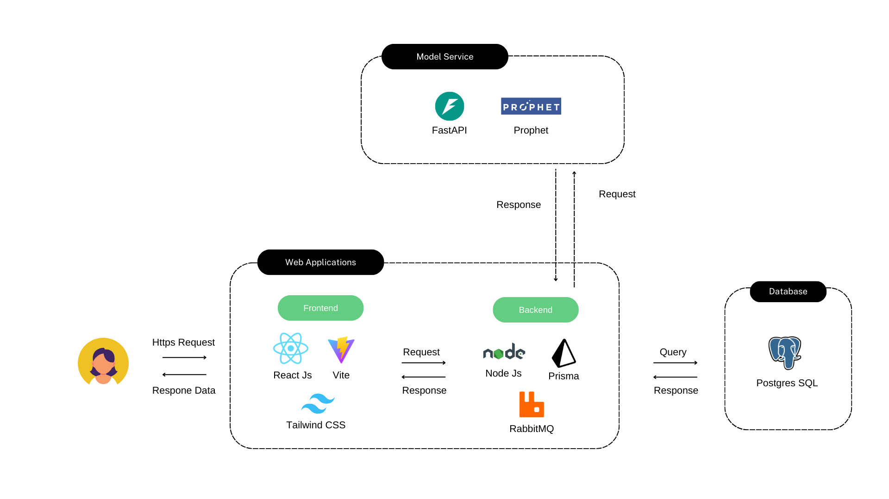

# FlexiStock
Smart Warehouse Management System

Link Demo [Link Youtube](https://youtu.be/jHjvXFGpb8U)

FlexiStock เป็นระบบจัดการสต็อกสินค้าอัจฉริยะ พัฒนาด้วย Node.js (Backend) และ React.js (Frontend) โดยใช้สถาปัตยกรรม Microservices Architecture เพื่อให้สามารถขยายตัวและรองรับปริมาณข้อมูลที่เพิ่มขึ้นได้อย่างมีประสิทธิภาพ โดยแยกการทำงานของระบบเป็นหลายบริการ (services) ที่สามารถทำงานได้อย่างอิสระและสื่อสารกันผ่าน API


---

| Layer      | Technologies                         |
|------------|--------------------------------------|
| Frontend   | React.js + Vite + Tailwind CSS       |
| Backend    | Node.js + Prisma ORM + RabbitMQ      |
| Model API  | FastAPI + Prophet (Time Series ML)   |
| Database   | PostgreSQL                           |
| External   | Google Maps API                      |

---




## ⚙️ Installation & Setup

> 💡 ต้องติดตั้ง `pnpm` ก่อนเริ่มต้นใช้งาน:
```bash
npm install -g pnpm
```
> ติดตั้ง Frontend
```bash
cd frontend
pnpm install
pnpm run dev
```
> ติดตั้ง Backend
```bash
cd Backend
 
for dir in */ ; do
  cd "$dir"
  pnpm install
  pnpm run dev
  cd ..
done
```
> ติดตั้ง Model Service (FastAPI + Prophet)
```bash
cd backend/forecast_service/pyservice
pip install -r requirements.txt
uvicorn main:app --reload
```
> ติดตั้ง prisma database (ยกเว้น api-gateway)
```bash
pnpm prisma generate
pnpm prisma migrate dev --name init
```


